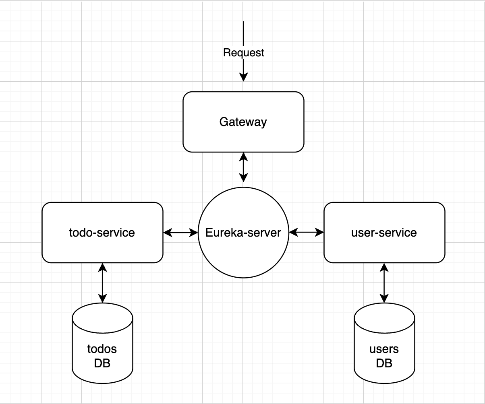

    

    <em>Powerful API for managing your todos, created using Spring Boot, with microservice architecture</em>

## Table of Contents

- [Architecture](#architecture)
- [Usage](#usage)
- [Endpoints](#endpoints)
- [Contributing](#contributing)

## Architecture

TodoAPI embraces the power of microservices to provide a scalable and maintainable architecture. It consists of four core microservices:

1. **Todos Microservice:** Handles all operations related to todos.
2. **Users Microservice:** Manages user authentication and user-related tasks.
3. **Service Discovery (Eureka Server):** Enables service registration and discovery.
4. **API Gateway:** Offers an entry point for all external requests and includes JWT authentication.

  

## Usage

**Important: All requests must be sent through the API Gateway: `http://104.248.166.249:1001/`**

Accessing the endpoints and functionalities of TodoAPI requires a valid JSON Web Token (JWT) in the "Authorization" header of your requests. To obtain a JWT token:

1. Register a user account.
2. Log in using your user credentials.
3. A JWT token will be included in the response.
4. The JWT token is valid for 24 hours.

## Endpoints

Swagger UI provides a comprehensive interface to explore and interact with the TodoAPI endpoints:

- [Users Microservice Endpoints](http://104.248.166.249:1002/swagger-ui/)
- [Todos Microservice Endpoints](http://104.248.166.249:1003/swagger-ui/)

## Contributing

We welcome contributions to enhance api. To contribute, follow these steps:

1. Fork this repository.
2. Create a new branch: `git checkout -b feature/your-feature-name`
3. Commit your changes: `git commit -am 'Add some feature'`
4. Push to the branch: `git push origin feature/your-feature-name`
5. Create a new Pull Request.
